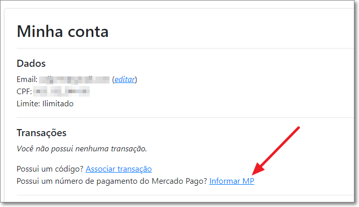

# Como associar um pagamento manualmente

Caso seu pagamento náo seja automaticamente indentificado, você pode fazer esse processo manualmente.

Basta associar a sua conta do Leitor ao número do pagamento realizado no Mercado Livre.

Para isso, acesse o menu "Minha Conta" e clique no link destacado na imagem abaixo:

⬅️ Voltar para o [Leitor de Notas](https://leitordenotas.com.br/).
