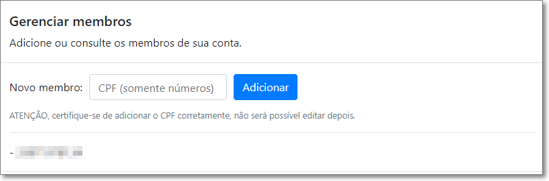

# Como adicionar outros CPFs a conta Família

Você pode gerenciar os membros de sua conta.

Através do menu "**Minha Conta**".

Clique em "**Gerenciar Membros**"

Adicione os novos CPFs.

Mas **atenção** certifique-se de que digitou corretamente, pois não é possível editar esses valores no futuro.

⬅️ Voltar para o [Leitor de Notas](https://leitordenotas.com.br/).
