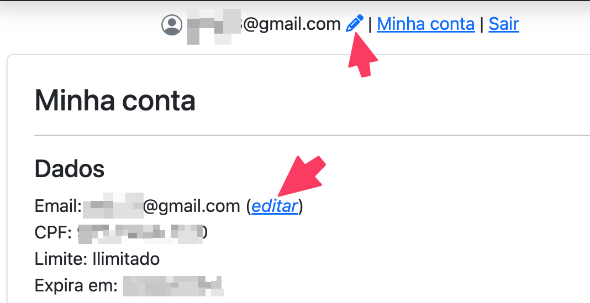

# Como editar meu email

Para editar seu email, acesse o menu "**Minha conta**" e clique no link "**editar**" que aparece logo a frente do seu endereço de email.

<figure><figcaption></figcaption></figure>
