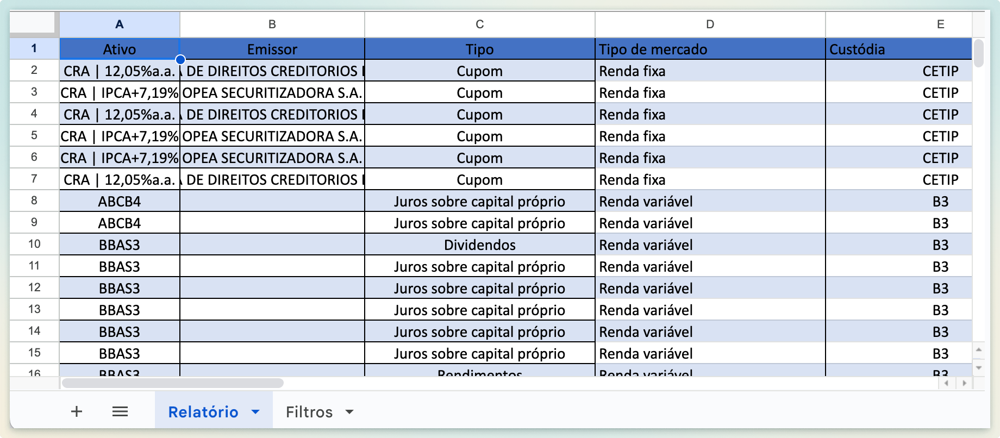
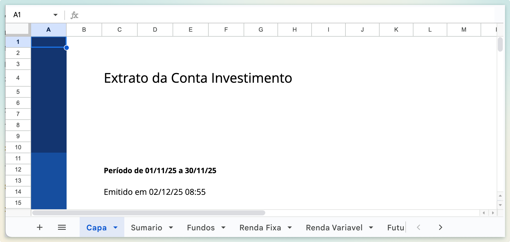

# BTG - Formato de extrato suportado pelo Leitor

O Leitor de Notas faz a leitura de extratos no BTG do tipo "Histórico de Proventos".\
Para obter este extrato no site da corretora, pelo computador, navegue para: `Histórico > Proventos > Extrato de proventos`

| Suportado                                                                                                                   | Não suportado                                                                                                            |
| --------------------------------------------------------------------------------------------------------------------------- | ------------------------------------------------------------------------------------------------------------------------ |
| 
<figure><figcaption></figcaption></figure>

 | 
<figure><figcaption></figcaption></figure>
 |
