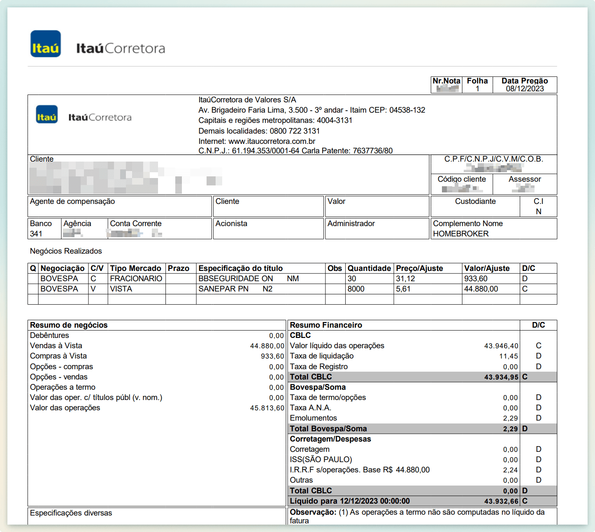
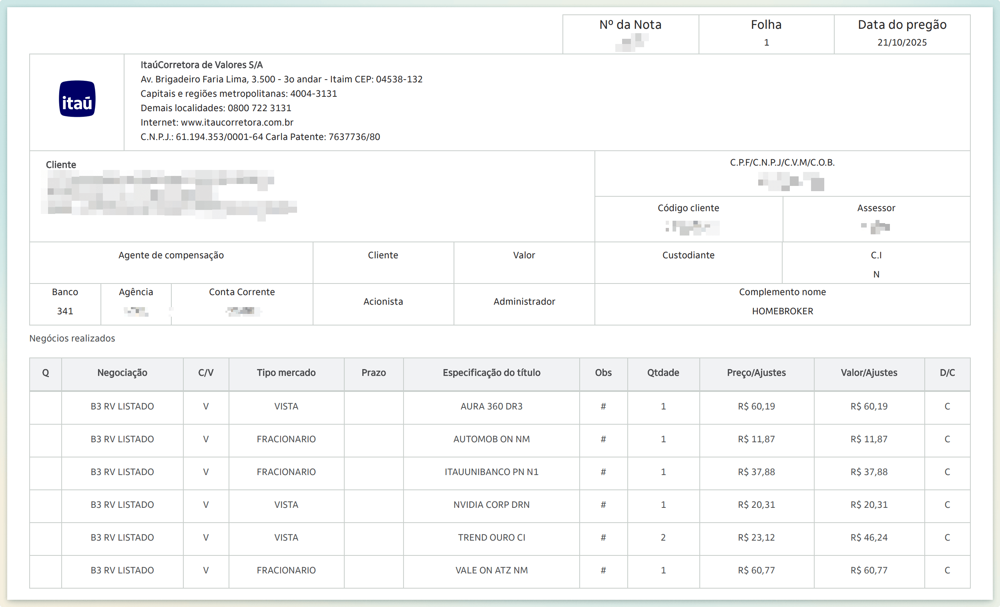
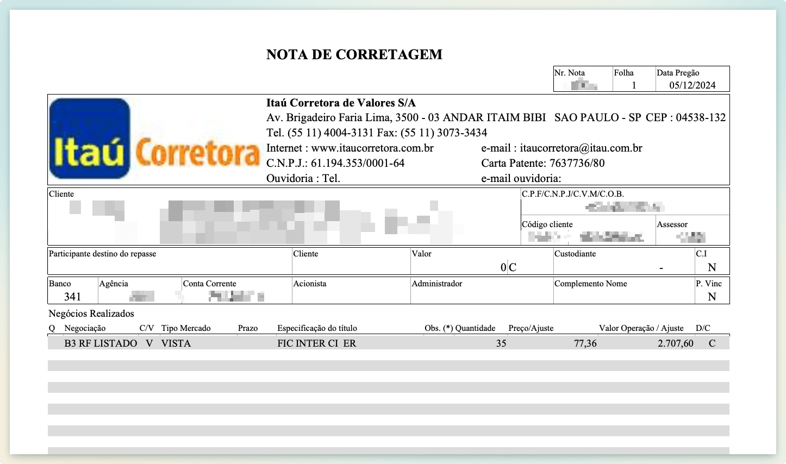

# Itaú - Formato de nota suportado pelo Leitor

Abaixo está um exemplo do formato de nota compatível com o Leitor de Notas.

Esse é o formato padrão de nota, conhecido como **padrão SINACOR**.

Notas exportadas através do app Íon não são compatíveis, exporte as notas através do Itaú.

<figure><figcaption></figcaption></figure> <figure><figcaption></figcaption></figure>

<figure><figcaption></figcaption></figure>
