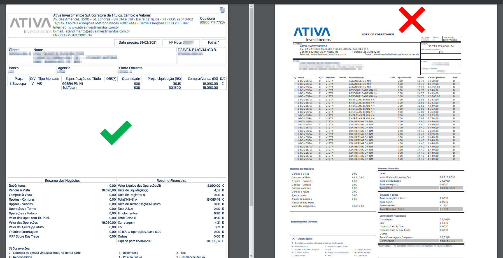

# Ativa - Formato de nota suportado pelo Leitor

Veja os exemplos de notas de corretagem que o Leitor de Notas suporta para a corretora Ativa

Sua nota de corretagem deve estar no padrão SINACOR.

Não se preocupe, esse é o formato padrão que as corretoras geram as Notas de Negociação.

Ao exportar sua nota no site da Ativa.

Faça isso através do Home Broker.

Não exporto através do menu "Minha Conta" > "Movimentações", pois, ele costuma gerar a nota no formato não suportado.

Mas caso queira conferir se sua nota esta no formato suportado pelo Leitor, compare com a imagem abaixo:

