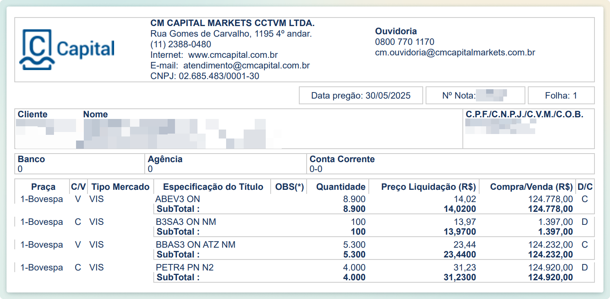

# CM Capital - Problemas de Leitura? Formato da nota

A corretora CM Capital fornece 2 tipos de notas de corretagem.

Um dos formatos da nota de corretagem é a do arquivo PDF enviado por email.\
O outro formato é a do PDF exportado através do Home Broker / site da corretora.

Na maioria dos casos, ambos os formatos podem ser utilizados normalmente. Mas existem casos (dependendo da operação realizada em bolsa) onde o arquivo enviado por email possui inconsistências que não existem no arquivo exportado no Home Broker.

Então se encontrar erros na leitura de seu arquivo, tente novamente com a versão do Home Broker.

| Nota enviada por email ✅                                                                                     | Nota do Home Broker ✅                                                                                        |
| ------------------------------------------------------------------------------------------------------------ | ------------------------------------------------------------------------------------------------------------ |
| 
<figure><figcaption></figcaption></figure>
 | 
<figure><figcaption></figcaption></figure>
 |
