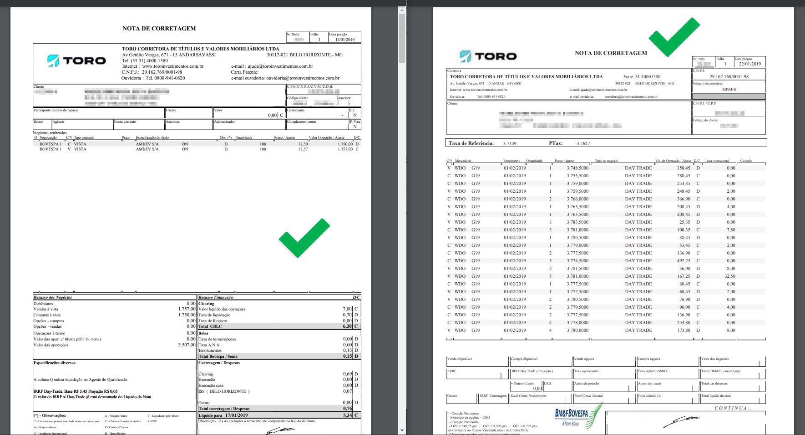

# Toro - Formato da Nota de Corretagem

Sua nota de corretagem deve estar no padrão SINACOR.

Não se preocupe, esse é o formato padrão que as corretoras geram as Notas de Negociação.

Caso não consiga obter a nota através da área logada ou do Homer Broker, você pode solicitar suas notas através do email ajuda@toroinvestimentos.com.br.

Mas caso queira conferir se sua nota esta no formato suportado pelo Leitor, compare com a imagem abaixo:

