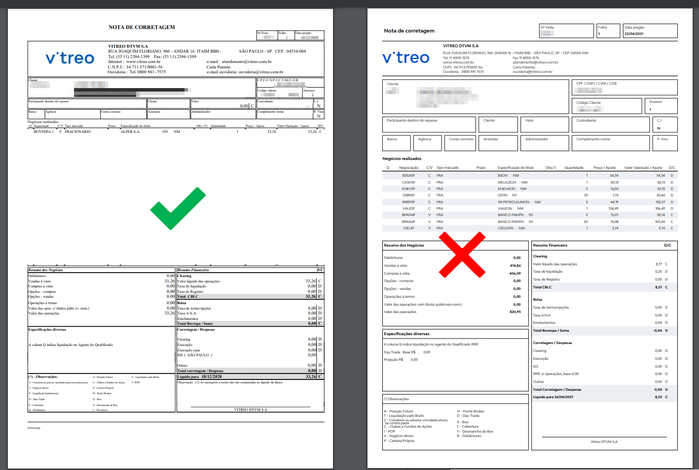

# Vitreo - Formato de nota suportado pelo Leitor

Veja os exemplos de notas de corretagem que o Leitor de Notas suporta para a corretora Vitreo

Sua nota de corretagem deve estar no padrão SINACOR.

Não se preocupe, esse é o formato padrão que as corretoras geram as Notas de Negociação.

Mas caso queira conferir se sua nota esta no formato suportado pelo Leitor, compare com a imagem abaixo:

🔍 [ampliar imagem](https://pasteboard.co/K00KA59.png)

⬅️ Voltar para o [Leitor de Notas](https://leitordenotas.com.br/).
