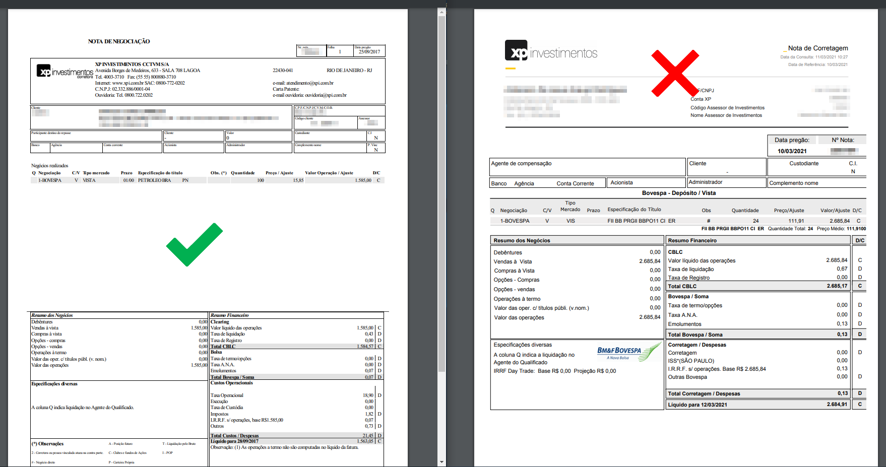

# XP - Formato de nota suportado pelo Leitor

Veja os exemplos de notas de corretagem que o Leitor de Notas suporta para a corretora XP.

A XP oferece 2 formatos de arquivos. Um formato no padrão B3 ou SINACOR e outro formato no padrão XP.

**Exporte o arquivo no padrão B3 ou SINACOR**, este formato é o suportado pelo Leitor.\
Para exportar o arquivo vá até o portal do cliente da XP e procure pelo local onde constam as notas de negociação.

Abaixo você conferir se sua nota esta no formato suportado pelo Leitor, compare com a imagem abaixo:

⬅️ Voltar para o [Leitor de Notas](https://leitordenotas.com.br/).
