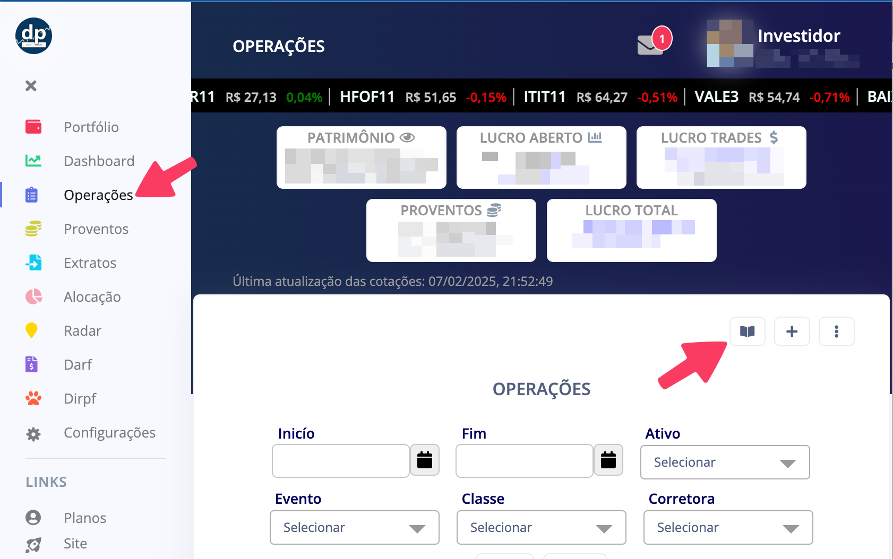

# Como importar no DLP Invest

Ao acessar o DLP Invest, clique em "Operações" e depois clique no botão do "Leitor de Notas".

<figure><figcaption></figcaption></figure>

Na nova janela que surgirá, faça o upload do PDF da nota de corretagem e então clique no botão "Importar operações".

<figure><figcaption></figcaption></figure>
