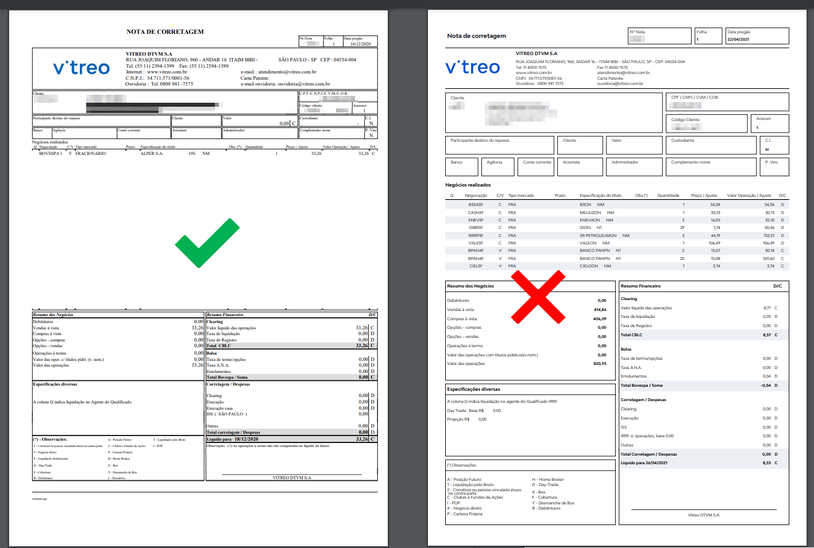

# Vitreo - Formato de nota suportado pelo Leitor

Veja os exemplos de notas de corretagem que o Leitor de Notas suporta para a corretora Vitreo

Sua nota de corretagem deve estar no padrão SINACOR.

Não se preocupe, esse é o formato padrão que as corretoras geram as Notas de Negociação.

Mas caso queira conferir se sua nota está no formato suportado pelo Leitor de Notas, compare com a imagem abaixo:

